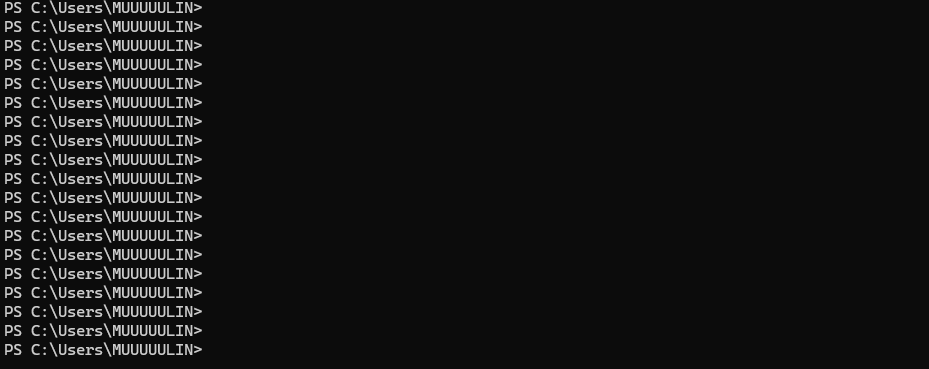

# esp-scaffold

> ESP-IDF 项目脚手架 —— 一条命令生成可编译的 ESP32 工程。

[](https://www.python.org/)
[](https://docs.espressif.com/projects/esp-idf/en/v5.4/)
[](LICENSE)

**你在开新项目时是不是这样：**

```
翻数据手册查引脚 → 复制上个项目的 CMakeLists → 粘贴 FreeRTOS 任务模板 
→ 手写 sdkconfig → 配外设驱动 → 编译 → 报错 → 查到引脚冲突 → 再来一遍
```

**用 esp-scaffold：**

```bash
esp-scaffold create --peripherals spi,i2c,uart --freertos-tasks 3 -o my_project
```

**30 秒生成一个能直接编译的 ESP-IDF 工程。**



---

## 安装

```bash
git clone https://github.com/MUUUUULIN/esp-scaffold.git
cd esp-scaffold
pip install -e .
```

或直接运行（不安装）：

```bash
git clone https://github.com/MUUUUULIN/esp-scaffold.git
cd esp-scaffold
set PYTHONPATH=.   # Windows cmd
# 或
export PYTHONPATH=.  # Linux / macOS
```

依赖只有两个：`click` + `jinja2`。`pip install click jinja2` 即可。

---

## 使用

### 看支持什么

```bash
python -c "from esp_scaffold.cli import main; main(['list'])"
```

```
Supported chips:
  - esp32s3

Supported peripherals:
  - spi
  - i2c
  - uart
  - pwm
  - gpio
```

### 生成项目

```bash
python -c "from esp_scaffold.cli import main; main(['create', \
    '--chip', 'esp32s3', \
    '--peripherals', 'spi,i2c', \
    '--freertos-tasks', '3', \
    '-o', 'my_project'])"
```

输出：

```
✅ Project 'esp-project' created at: my_project
   Chip: esp32s3
   Peripherals: spi, i2c
   FreeRTOS tasks: 3

   cd my_project/esp-project
   idf.py set-target esp32s3
   idf.py build
```

### 参数说明

| 参数 | 说明 | 默认值 |
|---|---|---|
| `--chip` | 目标芯片 | `esp32s3` |
| `--peripherals` | 外设列表，逗号分隔 | 无 |
| `--freertos-tasks` | FreeRTOS 任务数量 | `1` |
| `-o` / `--output` | 输出目录 | 当前目录 |
| `-n` / `--name` | 项目名 | `esp-project` |

---

## 生成的工程结构

```
my_project/esp-project/
├── CMakeLists.txt              # 顶层 CMake
├── sdkconfig.defaults          # 默认 Kconfig
├── partitions.csv              # 分区表
├── main/
│   ├── CMakeLists.txt
│   ├── main.c                  # app_main + FreeRTOS 任务骨架
│   ├── gpio_config.c           # GPIO 初始化
│   └── gpio_config.h
└── components/
    ├── driver_spi/             # SPI 驱动（SPI2_HOST, DMA）
    ├── driver_i2c/             # I2C 驱动（100kHz）
    ├── driver_uart/            # UART 驱动（115200）
    ├── driver_pwm/             # PWM 驱动（LEDC）
    └── driver_gpio/            # 扩展 GPIO 驱动
```

---

## 路线图

当前 v0.1 是 **MVP**，验证"社区是否需要这个工具"。根据反馈计划加入：

- [ ] **引脚冲突自动检测** —— ADC2 与 WiFi 冲突、Strapping 管脚、JTAG 占用
- [ ] **智能引脚分配** —— 选好外设后自动推荐不冲突的引脚组合
- [ ] **sdkconfig 智能生成** —— 根据外设组合自动配置 DMA 通道、中断优先级、时钟源
- [ ] **多芯片支持** —— ESP32 / ESP32-C3 / ESP32-C6 / ESP32-S3 全家桶
- [ ] **更多外设** —— I2S / SDIO / USB / CAN / Ethernet
- [ ] **网页版** —— 可视化引脚拖拽配置（类似 STM32CubeMX）
- [ ] **`pip install esp-scaffold`** —— 一行命令安装

> 你觉得还该加什么？[去 Issue 区告诉我](https://github.com/MUUUUULIN/esp-scaffold/issues)。

---

## 为什么做这个

乐鑫至今没有推出类似 STM32CubeMX 的官方图形化引脚配置工具。ESP32 开发者**羡慕 STM32CubeMX 但没等价物**——有人甚至把 STM32CubeMX 当 ESP32 画布用，导出 CSV 后写 Python 脚本转成 `pin_mapping.h`。

所以我想一步步做一个「ESP32 版 CubeMX-lite」。第一步，先把脚手架做好。

---

## License

MIT © 2026 MUUUUULIN

---

# esp-scaffold

> ESP-IDF project scaffolding tool — one command to a compilable ESP32 project.

### Quick Start

```bash
# Generate a project with SPI + I2C + 3 FreeRTOS tasks
python -c "from esp_scaffold.cli import main; main(['create', \
    '--chip', 'esp32s3', \
    '--peripherals', 'spi,i2c', \
    '--freertos-tasks', '3', \
    '-o', 'my_project'])"

cd my_project/esp-project
idf.py set-target esp32s3
idf.py build   # 0 error, 0 warning
```

### Why

Espressif has no official graphical pin configuration tool like STM32CubeMX. ESP32 developers are forced to manually check pin conflicts, copy-paste project boilerplate, and configure sdkconfig by hand every time they start a new project. This tool automates that.

Currently **v0.1 MVP** — collecting feedback from the community. [Tell me what you need](https://github.com/MUUUUULIN/esp-scaffold/issues).

### Requirements

- Python 3.8+
- `pip install click jinja2`
- ESP-IDF v5.4 (for compilation)

### License

MIT
